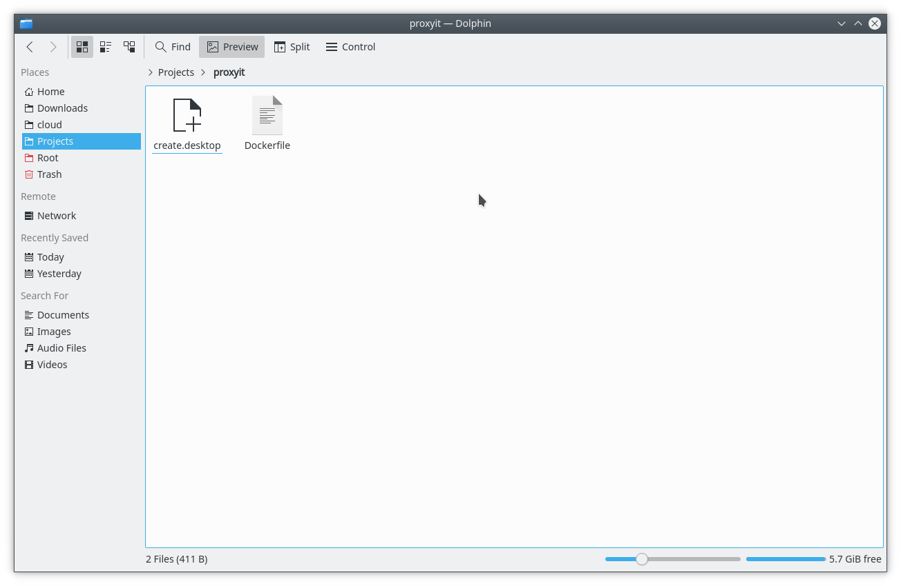
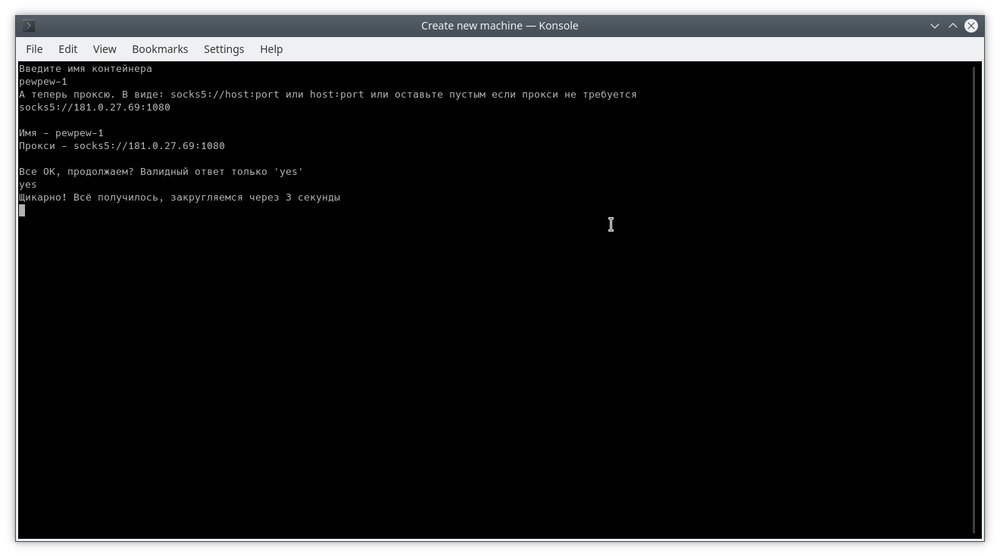
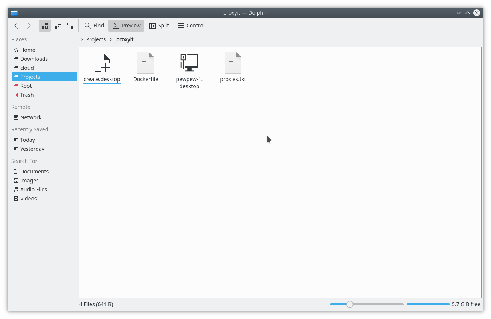
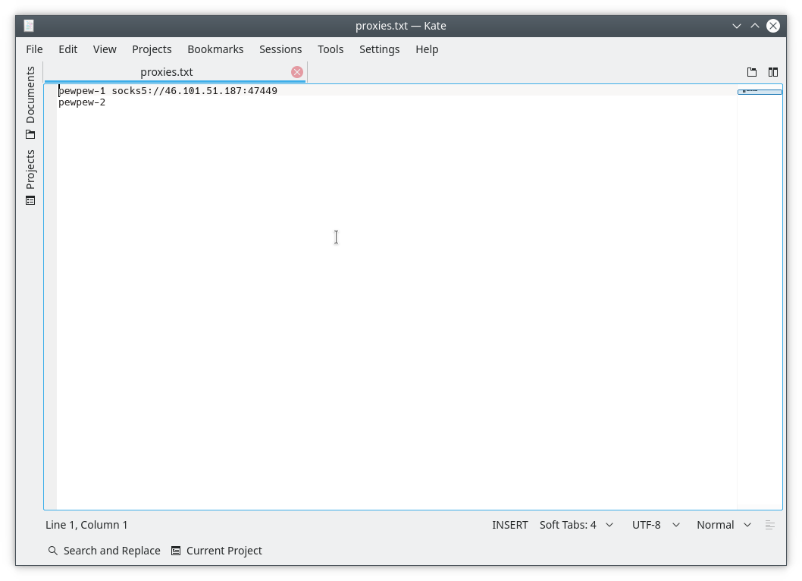
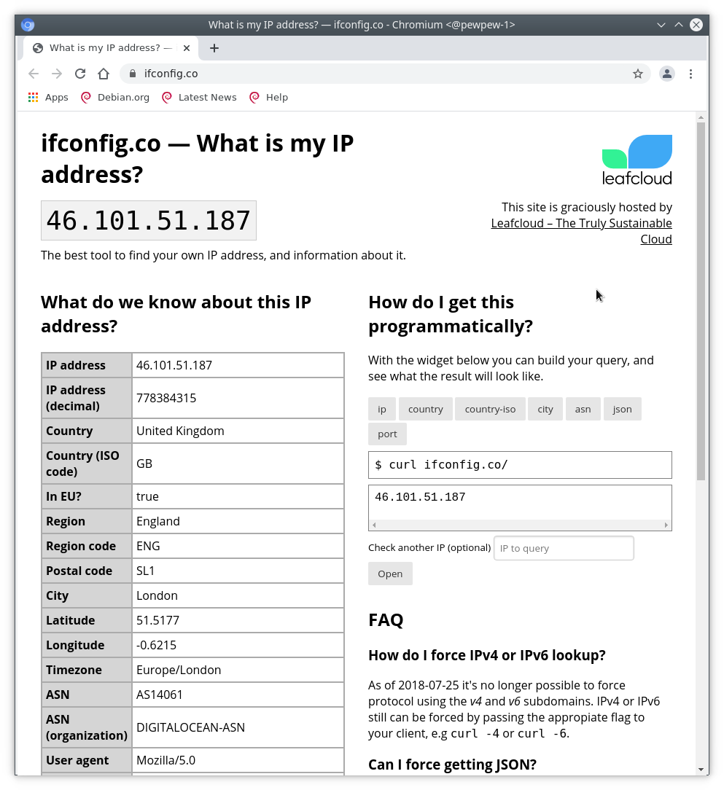

Эта штука нужна для быстрой контейнеризации браузера одновременно с привязкой прокси к браузеру.
Под капотом используется Chromium и Docker.

# Требования
Для работы этого шайтан-софта нужен гит (необязательно) и докер. Иструкция по установке докера есть на оффсайте: https://docs.docker.com/get-docker/

А, да. Для работы нужен линукс с GUI.

# Установка.
- Скачиваем самый свежий релиз [отсюда](/strngr/proxyit/releases), ну или клонируем репозиторий, если так привычней: `git clone https://github.com/strngr/proxyit`.
- Открываем директорию в графическом файловом менеджере.
- Кликаем по `create.desktop`.
  
- Вводим то что скрипт просит:
 - Имя машины.
 - Прокси.

Проверяем все ли правильно. Если все ок - пишем `yes`.
  
- Скрипт создаст ярлычок с именем машины.
  
- Связь "имя машины - прокси" будет внесена в файлик `proxies.txt`.
В случае если прокся сдохла - в файлике `proxies.txt` ее можно поменять либо убрать вовсе.
  
- При клике по ярлычку - открывается соответствующая машина.
  

Для того чтобы сохранить файлы с машины или загрузить их туда, в корне проекта есть директория `Downloads/`.
Эта директория общая для всех машин.
